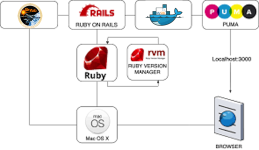
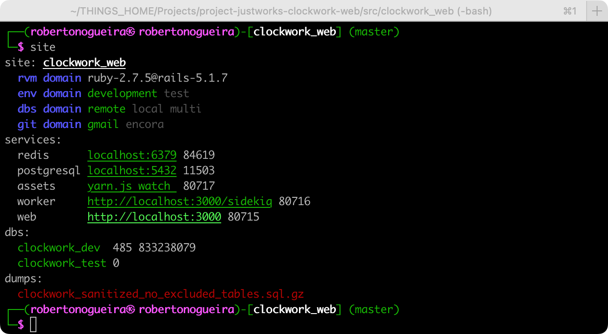

```
Roberto Nogueira  
BSd EE, MSd CE
Solution Integrator Experienced - Certified by Ericsson
```

# Rails Site Manager



**About**

This is in order to help the working CLI(Object Oriented Bash style) daily activities. It shows live relevant rails project information in the cli such as `rvm`, `env`, `db` and `git` domains, `services` and `databases` information.

**Advantages:**

* Development Flux and Environment seamlessly integrated.
* Live `rvm`, `env`, `db` and `git` domains, `services` and `databases` information.
* Support local and remote databases setups, remote import and download databases.
* Support start/stop services at once with consolidated logs.
* Better db consoles for `mysql`, `postgresql` and `redis`.

**Dependences:**

* Packages: [ack](https://beyondgrep.com), [ansi](https://github.com/fidian/ansi),[cowsay](https://github.com/tnalpgge/rank-amateur-cowsay), [fping](https://fping.org), [iredis](https://iredis.io), [mycli](https://www.mycli.net), [pgcli](https://www.pgcli.com), [pv](http://www.ivarch.com/programs/pv.shtml), [wget](https://ftp.gnu.org/old-gnu/Manuals/wget-1.8.1/html_mono/wget.html) and [xidel](https://github.com/benibela/xidel).
* Gem: [foreman](https://github.com/ddollar/foreman).

Se References below for further info.



Here it is shown possible CLI commands(relevant ones) according to the previous picture following CLI styles e.g. OO and usual bash which can be used interchangeably.

```shell
$ site.methods
methods|help|init|name|print|version

$ vpn.methods
methods|help|init|connected|loop|print

$ rvm.domain.methods
methods|help|init|development|print|test

$ env.domain.methods
methods|help|init|development|print|test

$ dbs.domain.methods
methods|help|init|local|multi|print|remote

$ git.domain.methods
methods|help|init|justworks.init|justworks|gmail.init|gmail|print
:
$ services.methods
methods|help|init|start|stop|print

$ services.mysql.methods
methods|help|init|console|list|restart|start|stop

$ services.redis.methods
methods|help|init|console|list|restart|start|stop

$ dbs.methods
methods|help|init|archives|console|current|download|import|dumps|create|refresh|delete|rebuild_test|print
```

**Example of uses:**

**1. Setup Local DB**

Here it is show a Setup of a Local `DB` e.g. Download/Import a `DB` from `Skylab` and then accessing it with `mycli`.

**Note:** In order to Download the `DB` from `Skylab`, the `AWS VPN Client` has to be connected. 

```shell
# this has to be performed just once
$ cp config/database.yml config/database.yml.local

$ site dbs.domain local

$ site dbs download
==> Downloading  clockwork_sanitized_no_excluded_tables.sql.gz
100%[============..==========>]  18.46G  4.62MB/s    in 62m 51

$ site dbs import 
==> Dropping  databases
==> Creating  databases
==> Importing  clockwork_sanitized_no_excluded_tables.sql.gz
19.2GiB 6:31:39 [ 858KiB/s] [============..===========] 100%

$ site dbs rebuild_test
==> Running rebuild_test.sh
==> Running dbs.init

$ site dbs console
Connecting to socket /tmp/mysql.sock, owned by user robertonogueira
MySQL
mycli 1.25.0
Home: http://mycli.net
Bug tracker: https://github.com/dbcli/mycli/issues
Thanks to the contributor - cxbig
MySQL root@(none):clockwork_dev> exit

$ site
site: clockwork_web  - AWS VPN Client
  rvm domain ruby-2.7.5@rails-5.1.7
  env domain development test
  dbs domain local remote multi
  git domain gmail justworks
services:
  redis      localhost:6379 58714
  mysql      localhost:3306 34946
  postgresql localhost:5432 11503
  assets, worker, web
dbs:
  clockwork_dev  485 807877204
  clockwork_test 485 3413
dumps:
  clockwork_sanitized_no_excluded_tables.sql.gz
```

**2. Setup Remote DB**

Here it is show a Setup of a Remote `DB` e.g. Creation a`DB` in `Sanitize-db` and then accessing it with `mycli`.

**Note:** In order to Create/Accesssin the `DB` in `Sanitize-db`, the `AWS VPN Client` has to be connected. 
Here it is show a check with Archives, a Creation of a remote `DB` in `Sanitized-db`, and a connection to the underlying `DB` by using `mycli` console. Once the `Sanitized-db` is created, an email is sent with the credentials and the `database.yml` for Remote use. So downloaded them and move to `config` directory under the Site as showed below.

```shell
$ site dbs archives
Archive data        File Name                               Ts     File Size
2022-06-26 23:22:29 light/latest/backup_light_latest.tar.gz latest 53 GB
:

$ site dbs create

$ mv ~/Downloads/database.yml.remote config/
$ mv ~/Downloads/database.yml.multi config/

$ site dbs.domain remote

$ site dbs console
MySQL
mycli 1.25.0
Home: http://mycli.net
Bug tracker: https://github.com/dbcli/mycli/issues
Thanks to the contributor - Jonathan Slenders
clockwork_dev> exit

$ site
site: clockwork_web  - AWS VPN Client
  rvm domain ruby-2.7.5@rails-5.1.7
  env domain development test
  dbs domain remote https://sanitized-db.justworks.com local multi
  git domain gmail justworks
services:
  redis      localhost:6379 58714
  postgresql localhost:5432 11503
  assets, worker, web
dbs:
  clockwork_dev  493 843986809
  clockwork_test 0
```

**3. Start/Stop Services**

Here it is show the Start/Stop the underlying site services.

```shell
$ site services start
03:54:44 web.1    | started with pid 83120
03:54:44 worker.1 | started with pid 83121
03:54:44 assets.1 | started with pid 83122
:

# from another terminal
$ site
site: clockwork_web  - AWS VPN Client
  rvm domain ruby-2.7.5@rails-5.1.7
  env domain development test
  dbs domain remote https://sanitized-db.justworks.com local multi
  git domain gmail justworks
services:
  redis      localhost:6379 58714
  postgresql localhost:5432 11503
  assets     yarn.js watch  83122
  worker     http://localhost:3000/sidekiq 83121
  web        http://localhost:3000 83120
dbs:
  clockwork_dev  493 843986809
  clockwork_test 0
dumps:
  clockwork_sanitized_no_excluded_tables.sql.gz

$ site services stop
:
```

**For further help:**

```shell
$ site --help
Crafted (c) 2021~22 by Encora - We are stronger together
Site v1.0.09

site    [print|update|version]
vpn    [connected|loop|print]
::
rvm.domain    [print]
env.domain    [print|development|test]
dbs.domain    [print|local|remote|multi]
git.domain    [print|justworks|gmail]
::
dbs    [print|archives|download|import|dumps|create|refresh|delete|rebuild_test]
services    [print|start|stop]
services.mysql    [console|list|restart|start|stop]
services.redis    [console|list|restart|start|stop]
::
homepage https://github.com/enogrob/rails-site-manager
```

**Installation:**

```shell
# install site and its deps
pushd /tmp
mkdir -p ~/Projects
git clone git@github.com:enogrob/rails-site-manager.git
cd rails-site-manager
brew bundle --no-upgrade
cd ..
curl -OL git.io/ansi
chmod 755 ansi
sudo mv ansi /usr/local/bin/
mv rails-site-manager ~/Projects
popd

# install foreman gem
pushd ~/Projects/clockwork_web
gem install foreman --no-document
popd
```

**Configuration**

It is required that the some initial values are set in initialization section of the `site` script e.g. `site.init`. e.g.
```shell
:
site.init(){
  unset fnames
  :
  git.domain.justworks.init "Roberto Nogueira" "rnogueira@justworks.com"
  git.domain.gmail.init "Roberto Nogueira" "enogrob@gmail.com" 
  :
}
:
```

Also add the source of the `Rails Site Manager` and the `Puppet Credentials` in the `~/.bashrc` .
```shell
:
# rails site manager
export PUPPET_USER=<user login>
export PEPPET_PASS=<password>
test -f  "$HOME/Projects/rails-site-manager/site" && source "$HOME/Projects/rails-site-manager/site"
:
```

Also the `database.yml.remote`, `database.yml.multi` and `database.yml.local` have to be placed in `config` directory in Rails project directory tree e.g. `clockwork_web`.

**Note:** The files `database.yml.remote` and `database.yml.multi` are downloaded from the `sanitized DB` email.

```shell
pushd ~/Projects/clockwork_web
cp config/database.yml config/database.yml.local
mv ~/Downloads/database.yml.remote config/
mv ~/Downloads/database.yml.multi config/
popd
```

Once all that is performed just source the `~/.bashrc`, and one is ready to go!
```shell
source ~/.bashrc
```

**Note:** This underlying project is still under development so mind __to keep its local repo updated__.

```shell
pushd ~/Projects/rails-site-manager
git pull
popd
```

or just

```shell
site update
```

**Changes log**

* **1.0.09** Add method `notify` to `site`.
* **1.0.08** Add method `archives` to `dbs`.
* **1.0.07** Add method `rebuild_test` to `dbs`.
* **1.0.06** Refactor `git.domain` and add methods `create|refresh|delete` to `dbs`.
* **1.0.05** Add `vpn` namespace.
* **1.0.04** Refactor `dbs.import`.
* **1.0.03** Refactor `dbs.domain` as a really namespace.
* **1.0.02** Improve `dbs.domain.print` and corrected `dbs.init`.
* **1.0.01** Implement methods `console|list|restart|start|stop` for  `services.msql` and `services.redis`.
* **1.0.00** First release.

**Refs:**

Based on: [research-obras-devtools](https://github.com/enogrob/research-obras-devtools) - Obras Development process, development utilities and support for Foreman, Docker and editors VsCode and Rubymine.

* [ack](https://beyondgrep.com) - grep-like source code search tool.
* [ansi](https://github.com/fidian/ansi) - Escape codes in pure bash.
* [cowsay](https://github.com/tnalpgge/rank-amateur-cowsay) - Configurable talking characters in ASCII art.
* [foreman](https://github.com/ddollar/foreman) - Manage Procfile-based applications.
* [fping](https://fping.org) - Scriptable ping program for checking if multiple hosts are up.
* [iredis](https://iredis.io) - A Terminal Client for Redis with AutoCompletion and Syntax Highligting.
* [mycli](https://www.mycli.net) - A Terminal Client for Mysql with AutoCompletion and Syntax Highligting.
* [pgcli](https://www.pgcli.com/) - A Terminal Client for Postgresql with AutoCompletion and Syntax Highligting.
* [pv](http://www.ivarch.com/programs/pv.shtml) - Pipe Viewer.
* [wget](https://ftp.gnu.org/old-gnu/Manuals/wget-1.8.1/html_mono/wget.html) - The noninteractive downloading utility.
* [xidel](https://github.com/benibela/xidel) - Command line tool to download and extract data from HTML/XML pages or JSON-APIs.
