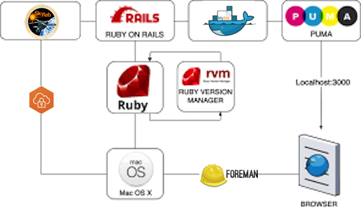

```
Roberto Nogueira  
BSd EE, MSd CE
Solution Integrator Experienced - Certified by Ericsson
```
# Project Site Manager



**About**

This is in order to help the working CLI daily activities. It shows the `vpn`, `servers` and  `vms` current status, besides the further info about `projects` and `screen` sessions. 

**Advantages:**

* Development Flux and Environment seamlessly integrated.
* Live **vpns, servers, vms, screens and projects** information.
* Supports for Linux.
* Object-Oriented bash style
* Supports [**screen**](https://man7.org/linux/man-pages/man1/screen.1.html), [**fast ping**](https://fping.org) and [Virtual Box](https://www.virtualbox.org).

See example of use below:

**Note:** When appears "username" type `enter` and when appears "Password:" type `shift insert`.

```shell
$ site daitan on
$ site windriver on
:
Disconnecting...                                                       
Retrieving configuration...                                            
wr.alameda.windriver.com - Authentication Failed. Enter login credentials
username(rmartins): 
Password:
Discovering network...                                                 
Connecting...                                                          
Connected                                                              
1.        APAC (Tokyo) Japan                                           
2.        APAC (Chengdu) China
3.        Europe (Galati)
4.        APAC (Seoul) South Kore
5.        Europe (Ismaning)
6.        Central America (San Jose) Costa Rica
7.        APAC (Beijing) China
8.        North America West (Alameda)
9.        North America East (Ottawa)
Please choose gateway from the list above(1-9):8
Disconnecting... 

$ site
site: rnogueira@brcpqn0753
  git domain gmail
vpns:
  daitan, windriver
servers:
  cgts1, cgts2, cgts3, cgts4
  desktop
vms:
  src_default_1641313050615_43957
  src_starlingx_1639633783883_48452
projects:
  1 2022-01-07 tutorial-building-debian  #debian #tutorial 
  2 2022-01-07 project-puppet-postgresql-upgrade  #puppet 
  1 2022-01-11 etc-rails-caio-rodrigo  #etc #rails 
  2 2022-01-12 etc-rails-mauricio-almeida  #etc #rails 
```


## Requirements and Tips

In order to install `Site Manager`, it is required that the following has been installed already:

* [git](https://git-scm.com/book/en/v2/Getting-Started-Installing-Git)
* [globalprotect](https://www.paloaltonetworks.com/products/globalprotect)
* [nmcli](https://developer-old.gnome.org/NetworkManager/stable/nmcli.html)
* [stoken](https://sourceforge.net/p/stoken/wiki/Home/)
* [project-today-manager](https://github.com/enogrob/project-today-manager)
* [project-tag-manager](https://github.com/enogrob/project-tag-manager)

In order to install and setup it follow instruction in [dpkg -PGlobalprotect Wind River VPN Setup](https://docs.google.com/document/d/1pDv9N1akQF3vLSZaLkG8haJDC9IHcjsjMd4E-i51_TM/edit#heading=h.mhdfsj3fpjud) and in the [video](https://drive.google.com/file/d/1DXAHrQxn0ZFPCa2tb7Rma-Evep27lz4O/view).

**For further help:**

```shell
Crafted (c) 2021~22 by Daitanlabs - We are stronger together 
Site v1.0.08

site [site    [help|daitan|desktop|domain|print|projects|servers|screens|cgts1|cgts2|cgts3|cgts4|vms|vpns|windriver]]
site [domain  [help|daitan|gmail|windriver]]

site [vpns       [fixroute|help|print]]
site [daitan     [help|off|on|off|ping|status|url]]
site [windriver  [help|gateways|off|on|off|ping|start|status|stoken|url]]

site [servers  [help|print]]
site [cgts1~4  [help|hostname|ip|methods|ping|user]]
site [daitanwr  [help|hostname|ip|methods|ping|user]]

site [vms  [headless|halt|help|control|ls|print|snapshot|ssh|ssh-copy-id|status|suspend|up]]
site [screens   [help|inside|print]]
site [projects  [help|ls|print]]
::
homepage http://bitbucket.wrs.com/users/rmartins/repos/project-site-manager
```

**Installation**

```shell
pushd /tmp
git clone git@github.com:enogrob/project-today-manager.git
source ./project-today-manager/today
mv project-today-manager ~/Projects
echo "test -f ~/Projects/project-today-manager/today && source ~/Projects/project-today-manager/today" >> ~/.bashrc
popd 

pushd ~/Projects
git clone git@github.com:enogrob/project-tag-manager.git
echo "test -f ~/Projects/project-tag-manager/tag && source ~/Projects/project-tag-manager/tag" >> ~/.bashrc
git clone ssh://git@bitbucket.wrs.com:7999/~rmartins/project-site-manager.git
echo "test -f ~/Projects/project-site-manager/site && source ~/Projects/project-site-manager/site" >> ~/.bashrc
source ~/.bashrc
popd
```

**Configuration**

It is required that the initial values for `domains`, `vpns` and  `servers` are set in initialization section of the `site` script.

**Changes log**

* **1.0.08** Fix domains.
* **1.0.07** Support for Virtual Box.
* **1.0.06** Support for Desktop.
* **1.0.05** Further refactoring.

**Refs:**
* **[How To Use Linux Screen](https://linuxize.com/tags/screen)** - Screen or GNU Screen is a terminal multiplexer, you can start a screen session and processes running will continue to run.
* **[fping](https://fping.org)** - Scriptable ping program for checking if multiple hosts are up..

