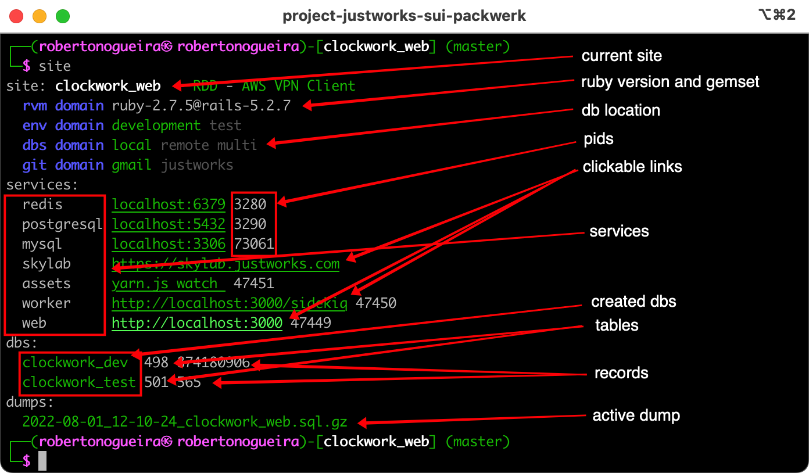

```
Roberto Nogueira  
BSd EE, MSd CE
Solution Integrator Experienced - Certified by Ericsson
```

# Rails Site Manager


**About**

This is in order to help the working CLI daily activities. It shows live relevant rails project information in the cli such as `rvm`, `env`, `db` and `git` domains, `services` and `databases` information.

**Advantages:**

* Development Flux and Environment seamlessly integrated.
* Live `rvm`, `env`, `db` and `git` domains, `services` and `databases` information.
* Support local and remote databases setups, remote import and download databases.
* Support start/stop services at once with consolidated logs.
* Better db consoles for `mysql`, `postgresql` and `redis`.

Dependences:

* Packages: ansi, iredis, mycli, pgcli, pv and wget.
* Gem: foreman.

See example of use below:



## Requirements and Tips

In order to install `Site Manager`, it is required that the following has been installed already:

* [git](https://git-scm.com/book/en/v2/Getting-Started-Installing-Git)
* [project-today-manager](https://github.com/enogrob/project-today-manager)
* [project-tag-manager](https://github.com/enogrob/project-tag-manager)

**For further help:**

```shell
Crafted (c) 2021~22 by Encora - We are stronger together
Site v1.0.00

site [site    [methods|help|init|function_handler|function_names|name||is_site|print|version||env.domain|rvm.domain|git.domain|projects|dbs|services]]

site [git.domain  [methods|help|init|encora.init|encora|gmail.init|gmail|print]]
site [rvm.domain  [methods|help|init|print]]
site [env.domain  [methods|help|init|development|print|test]]

site [projects  [methods|help|init|ls|print]]
::
site [dbs  [methods|help|init|parse_yml|console|current|has_database|tables|has_tables|records|has_records|print_db|print|location|domain|domain.print|download|import]]
site [services  [methods|help|init|start|stop|print_up|print_ups|print_down|print_downs|print]]
::
homepage https://github.com/enogrob/rails-site-manager
```

**Installation:**

```
pushd /tmp
# install site
mkdir -p ~/Projects
cd ~/Projects
git clone git@github.com:enogrob/rails-site-manager.git
echo "test -f ~/Projects/rails-site-manager/site && source ~/Projects/rails-site-manager/site" >> ~/.bashrc
source ~/.bashrc
# install site deps
curl -OL git.io/ansi
chmod 755 ansi
sudo mv ansi /usr/local/bin/
brew bundle Brewfile
gem install foreman --no-document
popd
```

**Configuration**

It is required that the initial values for `domains` are set in initialization section of the `site` script e.g. `site.init`. Also the Puppet credentials has to be setup in the `~/.bashrc` .

**Changes log**

* **1.0.01** First release.

**Refs:**

* ansi
* foreman
* iredis
* mycli
* pgcli
* pv
* wget
